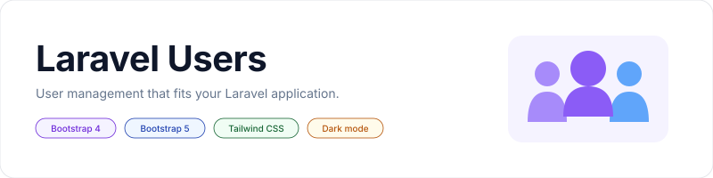

<p align="center">
    <picture>
        <source media="(prefers-color-scheme: dark)" srcset="art/banner-dark.svg">
        <source media="(prefers-color-scheme: light)" srcset="art/banner-light.svg">
        
    </picture>
</p>

<p align="center">User management for Laravel with configurable models, authentication, roles, search, and Blade views.</p>

<p align="center">
    <a href="https://packagist.org/packages/jeremykenedy/laravel-users"></a>
    <a href="https://packagist.org/packages/jeremykenedy/laravel-users"></a>
    <a href="https://github.com/jeremykenedy/laravel-users/actions/workflows/ci.yml"></a>
    <a href="https://github.styleci.io/repos/83162309"></a>
    <a href="LICENSE"></a>
</p>

## Table of Contents

- [Framework Support](#framework-support)
- [Requirements](#requirements)
- [Installation](#installation)
- [Quick Start](#quick-start)
- [Features](#features)
- [Configuration](#configuration)
- [Changing Frameworks](#changing-frameworks)
- [Artisan Commands](#artisan-commands)
  - [Install and Update Options](#install-and-update-options)
- [Roles and Optional Integrations](#roles-and-optional-integrations)
- [Routes](#routes)
- [Testing](#testing)
- [Historical Releases](#historical-releases)
- [License](#license)

## Framework Support

**Bootstrap 4 remains the default.** Running `composer update` does not publish files, change your frontend, install optional packages, or modify your application configuration. Existing routes, configuration keys (including their historical spelling), view names, and the `laravelusers` publish tag remain available.

| Frontend | Views | Assets | Default |
| --- | --- | --- | --- |
| Bootstrap 4 | Existing Blade templates and scripts | Existing configurable Bootstrap, jQuery, Popper, and Font Awesome URLs | Yes |
| Bootstrap 5 | Modern Blade templates | Bootstrap 5.3 CSS, optional host assets; plain JavaScript | No |
| Tailwind CSS | Modern Blade templates | Bundled, compiled Tailwind 4 utilities; plain JavaScript | No |

Modern views provide accessible form labels and errors, responsive tables, server pagination, search, and deletion confirmation. They do not require jQuery or a Node build in the consuming application. DataTables and Bootstrap tooltips remain options for the Bootstrap 4 views. Modern views use their own search and pagination controls.

## Requirements

This branch requires PHP 8.1 or newer, as before. CI covers Laravel 8 through 13 on compatible PHP versions. Older Laravel applications should retain their compatible package release; this update does not restore support for older PHP versions. Historical compatibility tests do not extend upstream framework security support.

The host application needs an existing users table, user model, and authentication setup.

## Installation

From an application with an existing users table, user model, and authentication setup:

```sh
composer require jeremykenedy/laravel-users
php artisan laravelusers:install
```

The interactive command asks for the framework, theme, and whether to publish views. It detects existing configuration and keeps the current choices as defaults. Existing configuration and published views are preserved. Visit `/users` after signing in. Package discovery registers the provider automatically.

For unattended installation with the existing default:

```sh
php artisan laravelusers:install --no-interaction
```

The package manages accounts; it does not install an authentication system, create administrator accounts, or change database schemas. Authentication is enabled by default. Configure your application's authorization middleware before exposing user management to ordinary signed-in users. Authentication alone is not an administrator permission check.

The original publishing workflow remains available:

```sh
php artisan vendor:publish --tag=laravelusers
```

It publishes configuration, translations, and all views. Laravel Collective is not required by the bundled templates. Previously customized templates that use it still need their own dependency.

## Quick Start

All three frontends use Blade. Choose one during installation:

```sh
php artisan laravelusers:install --framework=bootstrap4 --no-interaction
php artisan laravelusers:install --framework=bootstrap5 --no-interaction
php artisan laravelusers:install --framework=tailwind --no-interaction
```

Sign in and visit `/users`. Add `--theme=system` to follow the device color preference, or `--theme=dark` to start in dark mode.

## Features

- Create, search, edit, and delete users.
- Keep existing Bootstrap 4 views or choose Bootstrap 5 or Tailwind CSS.
- Use light, dark, or system themes with an optional theme selector.
- Configure user models, routes, role middleware, and parent layouts.
- Preserve published customizations during installation and updates.
- Back up published views before replacing them with `--force`.

## Configuration

The complete configuration is in [src/config/laravelusers.php](src/config/laravelusers.php). Applications may publish it or set the same keys in their configuration.

| Option | Default | Purpose |
| --- | --- | --- |
| `frontend` | `bootstrap4` | View framework: `bootstrap4`, `bootstrap5`, or `tailwind`. |
| `theme` | `light` | Default theme: `light`, `dark`, or `system`. |
| `themeToggle` | `false` | Show the theme selector. |
| `defaultUserModel` | `App\Models\User` | Application user model. |
| `authEnabled` | `true` | Require authentication for CRUD routes. |
| `rolesEnabled` | `false` | Enable role management. |
| `rolesMiddlwareEnabled` | `true` | Use role middleware when role support is enabled. |
| `rolesMiddlware` | `role:admin` | Role middleware name. |
| `enablePagination` | `true` | Paginate the user list. |
| `paginateListSize` | `25` | Users per page. |

Set `themeToggle` to `true` to show a light, dark, and system selector. A user's selection is stored locally in their browser. System mode follows their device preference. No dark mode package is required. Dark styles are scoped to the package interface. Existing published layouts need the theme partials added or a reviewed update before they can display the new selector.

If you use the setup commands, `laravelusers-ui.framework` and `laravelusers-ui.theme` take precedence over `laravelusers.frontend` and `laravelusers.theme`.

`laravelUsersBladeExtended` selects your parent layout. Custom layouts should render `template_title`, `template_linked_css`, `content`, and `template_scripts` sections. Custom view settings (`showUsersBlade`, `createUserBlade`, `showIndividualUserBlade`, `editIndividualUserBlade`) are never remapped. Only the four exact bundled view names switch to the modern templates when a modern framework is selected.

Asset switches remain available. `enableBootstrapCssCdn` controls loading Bootstrap CSS in the package layout; `bootstrap5CssCdn` selects the Bootstrap 5 stylesheet. `enableAppCss` and `enableAppJs` control host assets. Disable them when your application does not provide the configured `css/app.css` or `js/app.js`. Tailwind utilities are compiled and bundled with the package, with an `lu:` prefix and no global preflight reset. Custom layouts should load one framework stylesheet appropriate to the selected view set.

## Changing Frameworks

```sh
composer update jeremykenedy/laravel-users
php artisan laravelusers:update

php artisan laravelusers:update --framework=bootstrap5 --theme=system --no-interaction
php artisan laravelusers:update --framework=tailwind --theme=dark --no-interaction
php artisan laravelusers:update --framework=bootstrap4 --theme=light --no-interaction
```

Framework and theme choices are saved in `config/laravelusers-ui.php`. The command leaves existing `config/laravelusers.php` contents intact. Explicitly configured custom view names and custom parent layouts continue to take precedence. Clear a cached configuration before running the command, then rebuild it as part of deployment:

```sh
php artisan config:clear
php artisan laravelusers:update --framework=bootstrap5 --no-interaction
php artisan config:cache
```

`--force` applies only to views. Neither command overwrites existing main configuration or translations. To stop using a customized view, rename or remove that specific override after reviewing it. `--views=package` deliberately does not delete files. See [upgrading and rollback](docs/upgrading.md).

The update command supports both interactive selection and direct flags. Package assets are ready to use. If you change your host application's asset sources when switching, run `npm run build` in that application.

## Artisan Commands

| Command | Purpose | Options |
| --- | --- | --- |
| `laravelusers:install` | Set up the package, preserving existing configuration and views. | Options below. |
| `laravelusers:update` | Update framework, theme, and view publishing choices. | Options below. |
| `vendor:publish --tag=laravelusers` | Publish package configuration, translations, and views through Laravel. | Laravel's standard publish options. |

### Install and Update Options

| Option | Behavior |
| --- | --- |
| `--framework=bootstrap4\|bootstrap5\|tailwind` | Select a frontend. Omitted unattended updates retain the current selection. |
| `--theme=light\|dark\|system` | Select the default color theme. |
| `--views=package` | Use the view loader without publishing files. Existing overrides still take precedence. |
| `--views=publish` | Copy missing views to `resources/views/vendor/laravelusers`. Preserve existing files. |
| `--views=publish --force` | Back up the entire published view directory under `storage/app/laravelusers/backups`, then replace package-owned view files. |
| `--with=ui-kit` | Print optional integration setup instructions. Repeat for other integrations. |
| `--no-interaction` | Use current choices or package defaults without prompts. |

## Roles and Optional Integrations

Role support stays disabled by default. To enable it, configure your role model and middleware. The role-enabled user model must provide `roles`, `attachRole()`, `detachAllRoles()`, and, for the legacy detail view, `level()`. Role assignment and user changes use a database transaction on the user model's connection; role tables should use that same connection.

Optional packages are not runtime dependencies:

- [Laravel UI Kit](https://github.com/jeremykenedy/laravel-ui-kit)
- [Laravel Toast](https://github.com/jeremykenedy/laravel-toast)
- [Laravel Darkmode Toggle](https://github.com/jeremykenedy/laravel-darkmode-toggle)
- [Laravel IP Capture](https://github.com/jeremykenedy/laravel-ip-capture)
- [Laravel Seedster](https://github.com/jeremykenedy/laravel-seedster)

For setup instructions from either command:

```sh
php artisan laravelusers:install --with=ui-kit --with=toast
```

Also accepted: `--with=darkmode-toggle`, `--with=ip-capture`, and `--with=seedster`. These options print Composer and Artisan instructions; they do not install or configure another package. See [integration details](docs/integrations.md) before adding components, tracking, or seeds to your host application.

## Routes

| Method | URI | Name |
| --- | --- | --- |
| GET | `/users` | `users` |
| GET | `/users/create` | `users.create` |
| POST | `/users` | `users.store` |
| GET | `/users/{user}` | `users.show` |
| GET | `/users/{user}/edit` | `users.edit` |
| PUT/PATCH | `/users/{user}` | `users.update` |
| DELETE | `/users/{user}` | `user.destroy` |
| POST | `/search-users` | `search-users` |

Search accepts `user_search_box` and returns the existing JSON array of matching models, using the model's hidden attributes. Ensure sensitive attributes on custom user models are hidden. Search retains its existing `web` and `auth` middleware even when `authEnabled` is disabled for CRUD. Deleting the current authenticated user is blocked.

The `softDeletedEnabled` option is retained for compatibility; a deleted-user management screen is not implemented.

## Testing

```sh
composer update
composer check
npm ci
npm run build
npx playwright install chromium firefox webkit
npm run test:browser
```

Tests cover CRUD, validation, password hashing and preservation, authentication, roles and transactional rollback, search, missing users, pagination, custom models, configuration caching, installers, backups, view overrides, themes, and framework rendering. Browser tests exercise real HTTP requests and rendered Blade templates. Modern views receive automated accessibility checks in both themes.

See [testing](docs/testing.md) for the CI matrix and local fixture. The fixture is development-only and is never registered by the package service provider. Please include a reproducing test when submitting a bug fix.

## Historical Releases

For applications still on older Laravel versions, the previous installation pins were Laravel 5.5: `2.0.2`, Laravel 5.4: `1.4.0`, Laravel 5.3: `1.3.0`, and Laravel 5.2: `1.2.0`. Review each release's Composer requirements before upgrading an older application.

## License

This package is open-sourced software licensed under the [MIT license](LICENSE).
