<p align="center">
    <picture>
        <source media="(prefers-color-scheme: dark)" srcset="art/banner-dark.svg">
        <source media="(prefers-color-scheme: light)" srcset="art/banner-light.svg">
        
    </picture>
</p>

<p align="center">Manage Laravel user accounts with configurable access, views, roles, email, avatars, and account settings.</p>

<p align="center">
    <a href="https://packagist.org/packages/jeremykenedy/laravel-users"></a>
    <a href="https://packagist.org/packages/jeremykenedy/laravel-users"></a>
    <a href="https://github.com/jeremykenedy/laravel-users/actions/workflows/tests.yml"></a>
    <a href="https://github.styleci.io/repos/83162309"></a>
    <a href="LICENSE"></a>
</p>

<p align="center">
    <a href="https://www.codefactor.io/repository/github/jeremykenedy/laravel-users"></a>
</p>

<p align="center">
    <a href="https://github.com/jeremykenedy"></a>
    <a href="https://github.com/jeremykenedy/laravel-users"></a>
    <a href="https://github.com/sponsors/jeremykenedy" title="Sponsor jeremykenedy"></a>
</p>

## Table of Contents

- [Framework Support](#framework-support)
- [Requirements](#requirements)
- [Installation](#installation)
- [Quick Start](#quick-start)
- [Features](#features)
- [Configuration](#configuration)
- [Changing Frameworks](#changing-frameworks)
- [Artisan Commands](#artisan-commands)
  - [Install Options](#install-options)
- [Routes](#routes)
- [Optional Integrations](#optional-integrations)
- [Project Layout](#project-layout)
- [Testing](#testing)
- [Documentation](#documentation)
- [Screenshots](#screenshots)
  - [Mobile](#mobile)
  - [Tablet](#tablet)
  - [Desktop](#desktop)
- [License](#license)

## Framework Support

The package ships server-rendered Blade views. Bootstrap 4 remains the default for existing installations. Bootstrap 5 and Tailwind CSS are opt-in view styles. Changing CSS does not replace routes, models, application authentication, or custom views.

| CSS framework | Blade | Livewire | Vue 3 | React | Svelte |
| --- | --- | --- | --- | --- | --- |
| Bootstrap 4 | Supported, default | Not bundled | Not bundled | Not bundled | Not bundled |
| Bootstrap 5.3 | Supported, opt-in | Not bundled | Not bundled | Not bundled | Not bundled |
| Tailwind CSS 4 | Supported, opt-in | Not bundled | Not bundled | Not bundled | Not bundled |
| Materialize | Not bundled | Not bundled | Not bundled | Not bundled | Not bundled |
| Material Design 3 | Not bundled | Not bundled | Not bundled | Not bundled | Not bundled |
| Bulma | Not bundled | Not bundled | Not bundled | Not bundled | Not bundled |
| Foundation | Not bundled | Not bundled | Not bundled | Not bundled | Not bundled |

Livewire, Vue, React, and Svelte applications can link to the package's Blade routes. Native screens for those runtimes and the additional CSS frameworks are still pending. Unsupported selections are rejected before setup changes application files.

The package's documented compatibility suite covers Laravel 8 through 13, with framework and PHP versions paired in the [CI matrix](.github/workflows/tests.yml). Older Laravel applications should use a package version compatible with their framework and PHP runtime. See [framework setup and commands](docs/commands.md).

## Requirements

- PHP 8.1 or newer.
- Laravel 8 or newer, with compatibility validated against the versions in the CI matrix.
- An existing application user model, users table, and authentication guard.
- Composer.

The package does not create or alter the host users table, add an authentication system, or grant administrator access. Optional features may require their own published migrations, queue worker, or cache configuration. Those features are disabled by default.

## Installation

Install the package and run its setup command:

```sh
composer require jeremykenedy/laravel-users
php artisan laravelusers:install
```

The installer keeps Bootstrap 4 as the default, detects existing package configuration through the current settings, and preserves existing configuration and published views. It offers optional settings for CSS, theme, view publishing, avatars, notifications, and integrations. Use `--no-interaction` for scripted setup. Review the [installation and update guide](docs/commands.md) before enabling optional migrations or package changes.

The original publish command remains available:

```sh
php artisan vendor:publish --tag=laravelusers
```

The package also provides `php artisan laravelusers:publish`, with `laravel-users:publish` as an alias. It publishes configuration, translations, views, and versioned assets in `public/vendor/laravelusers/` while preserving existing host files. Install and update also publish these assets. The bundled templates do not depend on Laravel Collective HTML. If you have custom published views, check them for their own form-builder calls before removing a host application's dependency.

## Quick Start

The bundled interface uses Blade. Select the CSS framework during setup:

```sh
php artisan laravelusers:install --framework=bootstrap4 --no-interaction
php artisan laravelusers:install --framework=bootstrap5 --no-interaction
php artisan laravelusers:install --framework=tailwind --no-interaction
```

Sign in with an account authorized by the host application's middleware, then open `/users`. For an application-owned navigation menu, link to the package route:

```blade
<a href="{{ route('users') }}">Manage users</a>
```

Livewire navigation can use the same Blade link. Vue, React, and Svelte navigation can link directly to the default package URL:

```html
<a href="/users">Manage users</a>
```

These links open the package's Blade pages. Native screens and frontend components for those runtimes are still pending. See [standalone navigation components](docs/navigation-components.md) for the Blade components that can be embedded in a host layout.

## Features

- Create, view, edit, search, sort, filter, and delete users with paginated table or card layouts.
- Preserve the Bootstrap 4 experience by default, with optional Bootstrap 5 and Tailwind views.
- Keep soft-deleted users in a separate list, with authorized restore and permanent-delete actions.
- Restrict management routes and individual actions with host middleware, gates, roles, permissions, and supported role levels.
- Integrate optionally with Laravel Roles, Spatie Laravel Permission, and compatible custom role models.
- Track latest login time, IP address, device, operating system, browser, and recent online status when enabled.
- Select global or per-user avatar sources, including initials, local generators, Gravatar, DiceBear, and host-provided images.
- Send customizable welcome, password reset, account recovery, goodbye, and custom emails, individually or in bulk.
- Set global welcome-email defaults and enable or disable welcome actions from the administrator settings page.
- Preview email content before sending and retain edits when returning to the composer.
- Configure password strength rules and confirmation feedback for account creation and editing.
- Customize light and dark profile-card colors, gradient strength, notification style, and user account settings.
- Add a signed-in account page with profile, avatar, appearance, email, password, and account-removal controls.
- Use the theme toggle and user menu as standalone Blade components.
- Impersonate another account with role-based authorization, expiring sessions, verified state, and an exit control when explicitly enabled.
- Keep new account settings, cleanup, activity, and package-management features disabled unless explicitly enabled.

See [configuration](docs/configuration.md) and the individual feature guides for defaults, requirements, and upgrade notes.

## Configuration

The package configuration is [src/config/laravelusers.php](src/config/laravelusers.php). Existing installations retain Bootstrap 4 and existing option defaults. Every configuration option supports its documented `LARAVEL_USERS_*` environment variable fallback. The detailed configuration reference is maintained in [docs/configuration.md](docs/configuration.md).

| Setting | Default | Purpose |
| --- | --- | --- |
| `frontend` | `bootstrap4` | Preserve the original bundled views and styles. |
| `settings.enabled` | `false` | Keep the global settings page opt-in. |
| `emails.enabled` | `false` | Keep package email actions off until configured. |
| `welcome.enabled` | `false` | Require an administrator or environment opt-in for welcome actions. |
| `activity.login`, `activity.online` | `false` | Leave login history and online presence disabled. |
| `account.enabled`, `cleanup.enabled` | `false` | Keep end-user account controls and automatic cleanup disabled. |

The settings page is separately enabled with a migration and a host-defined authorization gate. Optional activity, account settings, per-user avatars, per-user appearance, deleted-account links, cleanup, Toast notifications, and managed package changes each have separate requirements. Do not enable them before reviewing [settings and access rules](docs/settings.md), [activity](docs/activity.md), and [integrations](docs/integrations.md).

## Changing Frameworks

Bootstrap 4 remains the default. Use `laravelusers:update` for interactive setup or explicit flags. It preserves the main config file and existing custom view overrides:

```sh
php artisan config:clear
php artisan laravelusers:update
php artisan laravelusers:update --framework=bootstrap5 --theme=system --no-interaction
php artisan config:cache
```

For a direct change without prompts, use `laravelusers:switch`:

```sh
php artisan laravelusers:switch --css=tailwind
php artisan laravelusers:switch --framework=bootstrap4 --theme=light
```

| Option | Values | Purpose |
| --- | --- | --- |
| `--framework` / `--css` | `bootstrap4`, `bootstrap5`, `tailwind` | Select the bundled Blade view styling. |
| `--frontend` | `blade` | Select the only bundled screen implementation. Other values are rejected. |
| `--theme` | `light`, `dark`, `system` | Set the initial package theme. |
| `--views` | `package`, `publish` | Use bundled views or publish missing view files. |
| `--force` | flag | Back up and replace published package views; only valid with `--views=publish`. |

The package includes its modern CSS assets. Run `npm run build` only when changing the package's Tailwind source or building host application assets. Existing host overrides take precedence. Read [upgrading and rollback](docs/upgrading.md) before replacing published views.

## Artisan Commands

| Command | Purpose | Options |
| --- | --- | --- |
| `laravelusers:install` | Configure the package and select optional integrations. | [Setup options](#install-options) and [integration flags](docs/commands.md) |
| `laravelusers:update` | Refresh view choices and optional integration setup while preserving config. | Same setup flags as install |
| `laravelusers:switch` | Apply explicit CSS, theme, view, avatar, role, or notification choices. | Same setup flags as install; pass choices explicitly |
| `laravelusers:publish` | Publish configuration, views, translations and versioned public assets; `laravel-users:publish` is an alias. | No package-specific flags |
| `laravelusers:setup-accounts` | Publish optional account, avatar, and appearance migrations. | `--migrate` |
| `laravelusers:setup-package` | Configure an installed Toast or roles package. | `package` argument, `--framework`, `--migrate` |
| `laravelusers:prune-deleted` | Permanently remove soft-deleted users when scheduled cleanup is enabled. | No package-specific flags |
| `laravelusers:prune-account-links` | Remove expired account-link records. | No package-specific flags |

Install, update, and switch share flags for CSS, Blade views, themes, role package selection, avatars, Toast, and optional setup tasks. Both `laravelusers:*` and `laravel-users:*` spellings are available for those commands. These three commands publish versioned assets and register the impersonation-state guard in an existing host web routes file. The full option list, publishing safeguards, queue setup, and safe removal steps are in [Artisan commands](docs/commands.md).

### Install Options

| Option | Values | Purpose |
| --- | --- | --- |
| `--framework` / `--css` | `bootstrap4`, `bootstrap5`, `tailwind` | Select the bundled view style. |
| `--frontend` | `blade` | Choose the bundled screen implementation. |
| `--theme` | `light`, `dark`, `system` | Set the initial theme. |
| `--views` | `package`, `publish` | Use bundled views or publish missing templates. |
| `--force` | flag | Back up and replace published views when `--views=publish` is selected. |
| `--no-interaction` | flag | Use current settings or explicit choices without prompts. |

Optional package installation and migration flags are documented in the [complete command reference](docs/commands.md).

## Routes

The package provides `/users` for the directory, `/users/deleted` for soft-deleted accounts, `/users/settings` for optional global settings, and `/users/account` for the signed-in account page. Account recovery links use `/users/account-link/{token}` when enabled. The complete route names, methods, middleware, and feature requirements are in [docs/routes.md](docs/routes.md).

Management routes use authentication and the configured package middleware. Authentication by itself does not grant administrator authorization. Configure a role middleware, a gate, or explicit access rules before exposing user management to ordinary signed-in accounts. The package prevents deleting the current authenticated user through its management actions.

## Optional Integrations

The package has no required Laravel Collective HTML or roles package dependency. Supported optional integrations include [Laravel Roles](https://github.com/jeremykenedy/laravel-roles), [Spatie Laravel Permission](https://github.com/spatie/laravel-permission), [Laravel Toast](https://github.com/jeremykenedy/laravel-toast), local DiceBear libraries, and host-provided avatar, UI, dark-mode, IP-capture, and seed services.

The install and update commands can show setup instructions and configure supported optional packages. The settings page can manage package installation or removal only when the queue, worker, cache, and authorization requirements are met. A second roles package cannot be installed alongside an already detected roles integration. Read [integrations](docs/integrations.md), [roles](docs/roles.md), and [package settings](docs/settings.md) before making dependency changes.

## Project Layout

```text
src/
  Actions/                 Account, email, and user operations
  App/Http/                Controllers, middleware, and requests
  App/Console/Commands/    Install, update, switch and publish commands
  Console/                 Compatible command classes and maintenance commands
  Support/                 Package integrations and configuration
  database/                Opt-in package migrations
  resources/views/         Blade screens, components, and email templates
  routes/                  Package routes
docs/                      Setup, feature, and upgrade guides
art/                       Theme banners and browser screenshots
tests/                     Feature, integration, and browser tests
phpunit.xml                Tests across the supported Laravel versions
phpunit.coverage.xml       PHP coverage configuration for PHPUnit 12
```

## Testing

Run the package checks locally:

```sh
composer validate --strict
composer check
npm ci
npm run build
npm run test:browser
```

CI covers PHP and Laravel compatibility, optional roles and presentation integrations, code style, dependency audit, coverage collection, and browser tests. See [testing and CI](docs/testing.md) for the matrix and fixture details. The browser fixture uses an isolated temporary database and sample users.

PHP coverage uses `phpunit.coverage.xml` with PHPUnit 12 and Xdebug. It includes package logic, routes, configuration and migrations. Blade templates and generated assets are checked by the browser suite. The requested 100% coverage target has not yet been reached.

## Documentation

All guides are available in the [`docs/` folder](docs/index.md):

- [Activity tracking and online status](docs/activity.md)
- [Avatar sources and local generators](docs/avatars.md)
- [Artisan commands, install, update, and package setup](docs/commands.md)
- [Configuration and environment variables](docs/configuration.md)
- [Email templates, previews, expiration, and account recovery](docs/emails.md)
- [Optional integrations](docs/integrations.md)
- [User impersonation and session security](docs/impersonation.md)
- [Standalone navigation components](docs/navigation-components.md)
- [Roles, permissions, and middleware](docs/roles.md)
- [Routes and authorization](docs/routes.md)
- [Global settings and access rules](docs/settings.md)
- [Testing and CI](docs/testing.md)
- [Upgrade and rollback guide](docs/upgrading.md)
- [Version history](CHANGELOG.md)

## Screenshots

These screenshots use sample accounts from the isolated preview application. The pages below are captured from the current Bootstrap 5 interface.

### Mobile

<table>
  <tr><th>User directory</th></tr>
  <tr><td>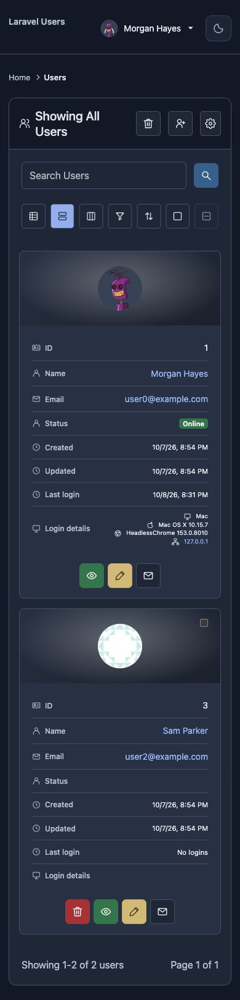</td></tr>
</table>

### Tablet

<table>
  <tr><th>User directory</th><th>User profile</th></tr>
  <tr>
    <td>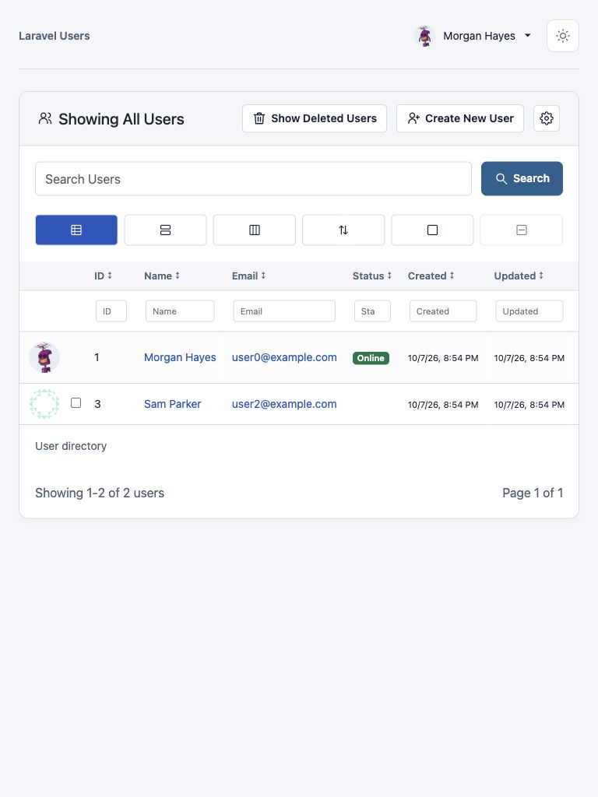</td>
    <td>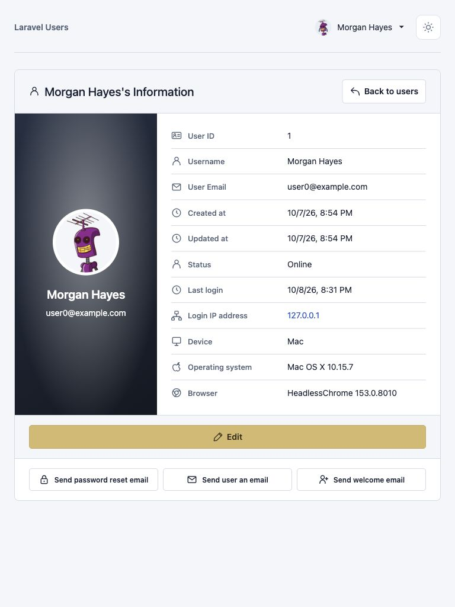</td>
  </tr>
</table>

### Desktop

<table>
  <tr><th>Active users</th><th>Deleted users</th><th>Create user</th></tr>
  <tr>
    <td>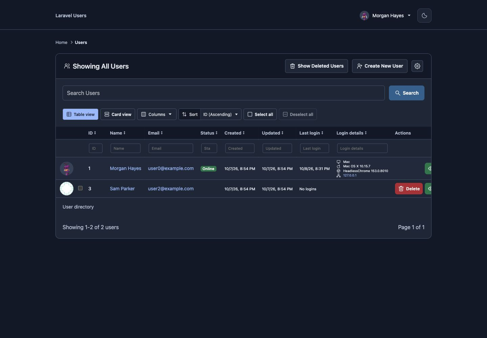</td>
    <td>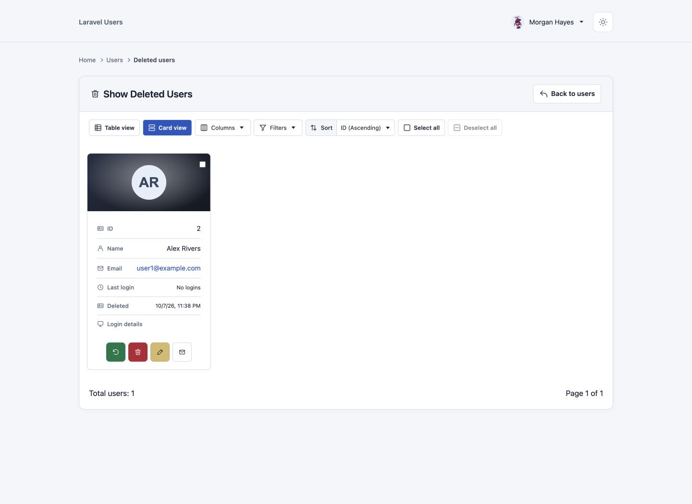</td>
    <td>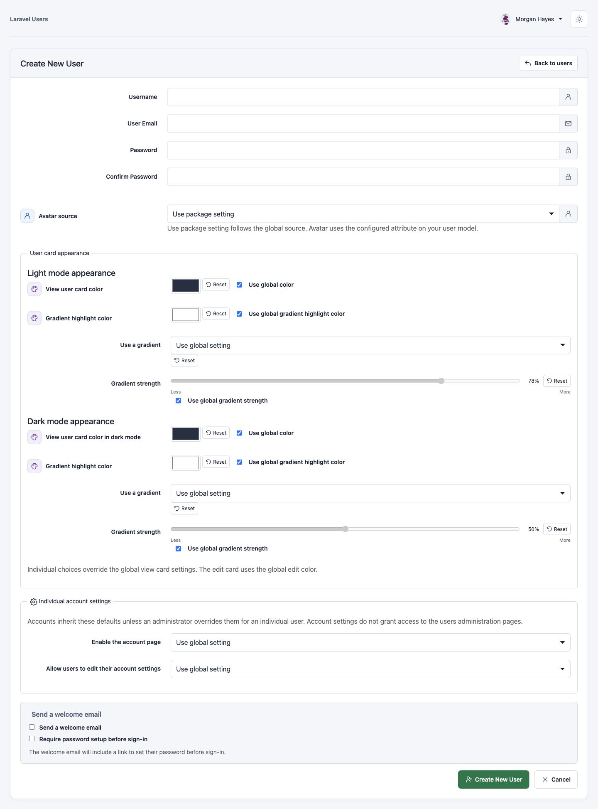</td>
  </tr>
  <tr><th>Edit user</th><th>Edit deleted user</th><th>User profile</th></tr>
  <tr>
    <td>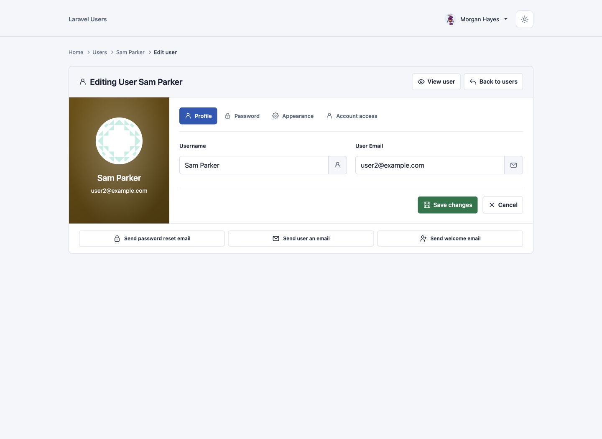</td>
    <td>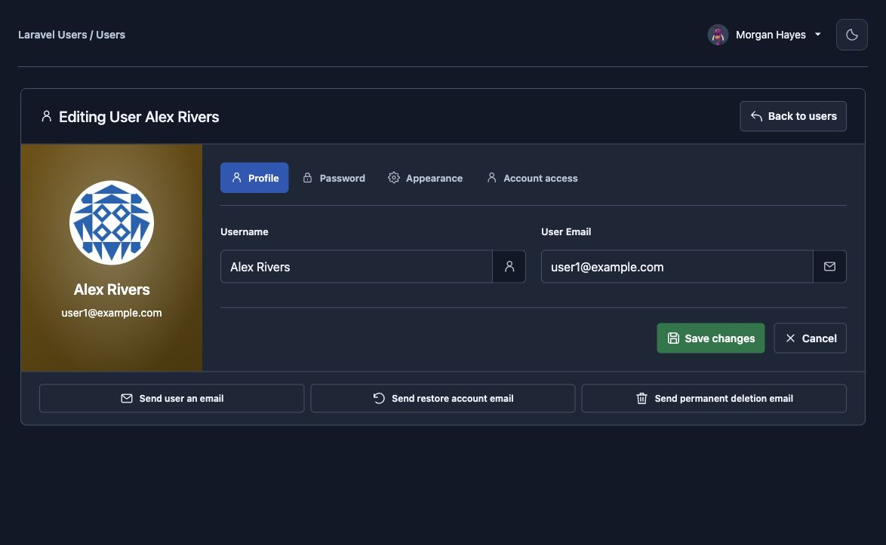</td>
    <td>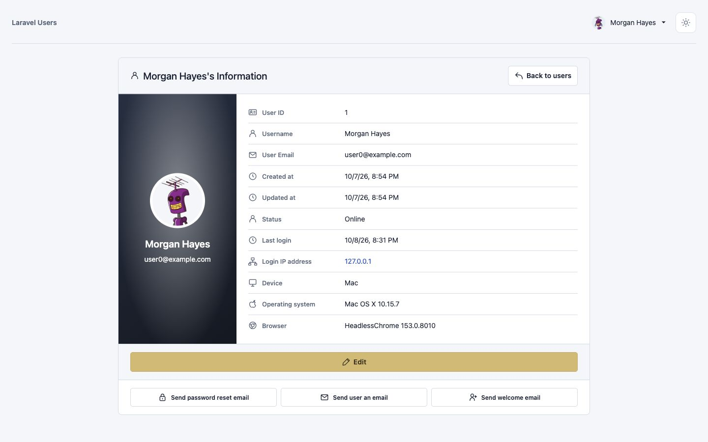</td>
  </tr>
  <tr><th>Global settings</th><th>Email settings</th><th>Account settings</th></tr>
  <tr>
    <td>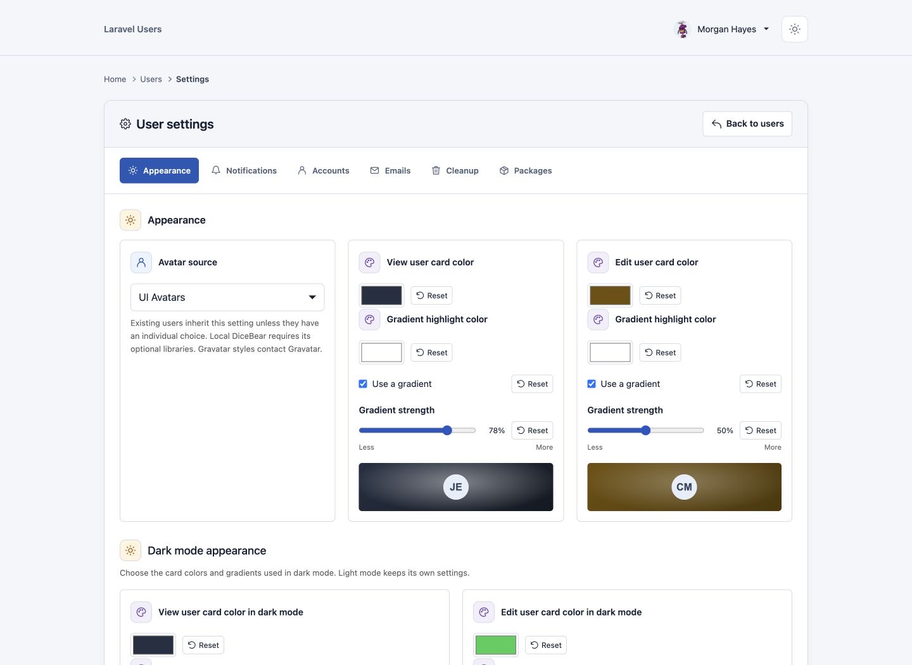</td>
    <td>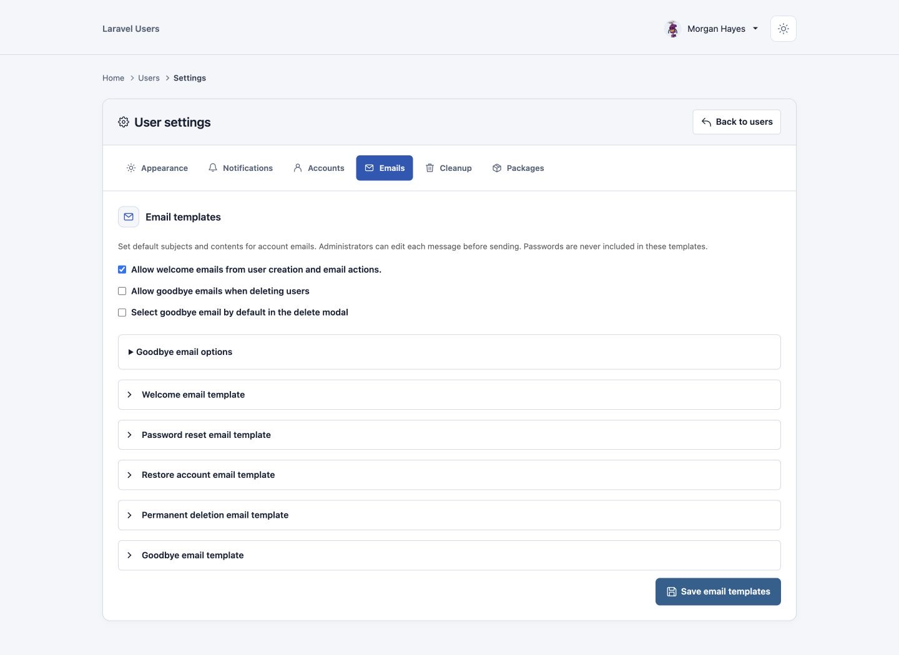</td>
    <td>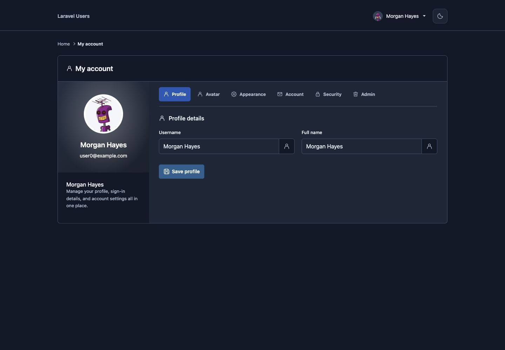</td>
  </tr>
  <tr><th>Email preview</th><th colspan="2">Account link confirmation</th></tr>
  <tr>
    <td>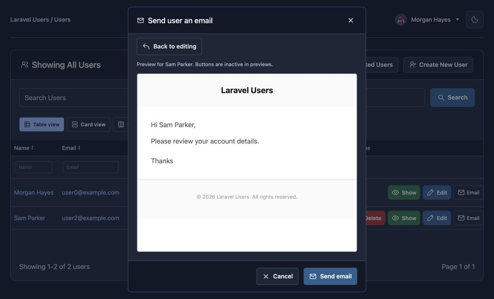</td>
    <td colspan="2">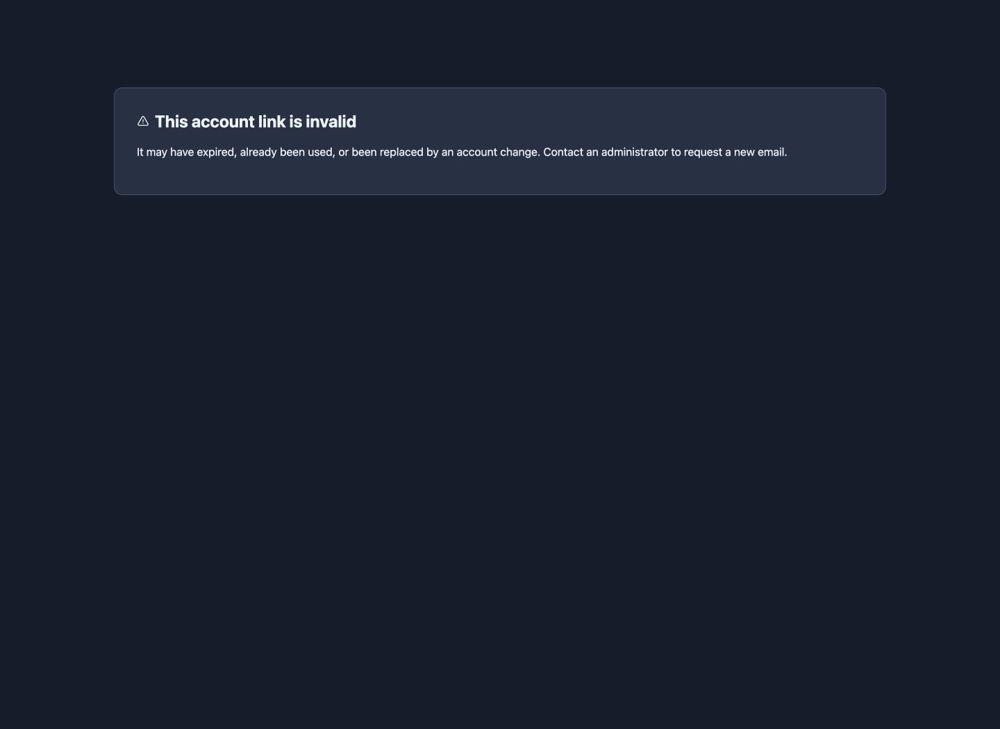</td>
  </tr>
</table>

## License

This package is open-sourced software licensed under the [MIT license](LICENSE).
